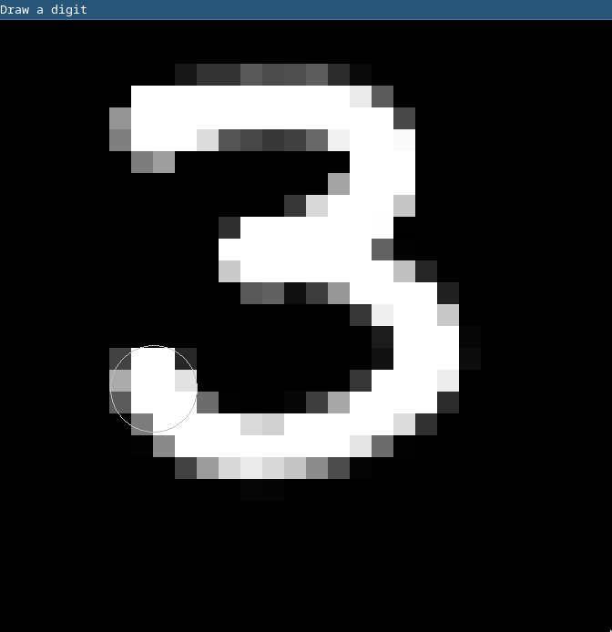

# neural-network

This Python library implements a simple neural network framework inspired by the [YouTube series on the subject by 3Blue1Brown](https://www.youtube.com/playlist?list=PLZHQObOWTQDNU6R1_67000Dx_ZCJB-3pi). The library allows for the instatiation, training, and evaluation of neural networks using backpropagation and stochastic gradient descent.

## Quick Start

Start by cloning the repository and setting up the virtual environment:

```sh
git clone git@github.com:pharrison31415/neural-network.git
cd neural-network
python -m venv .venv
source .venv/bin/activate
pip install -r requirements.txt
```

Try running one of the demo programs:

- `python -m Network.demo-negation`
- `python -m Network.demo-xor`

Also try running the digit recognition program on a pre-trained neural network:
`python guess-digit.py mnist.network`

## Programs

### `train-mnist.py`

Give this program a dataset and a number of epochs and let it run all night! With the power of stochastic gradient descent and a bit of luck, you'll be left with a well trained neural network! We recommend you use (on the order of) millions of epochs to get good results.

Usage:

```
$ python train-mnist.py MNIST_CSV EPOCHS OUT_FILE

 - MNIST_CSV is a csv file containing labels and pixel values for the MNIST dataset. Try unzipping mnist.csv.zip.
 - EPOCHS is the number of epochs to run the training for.
 - OUT_FILE is a file to dump the contents of the trained network.
```

### `guess-digit.py`

Try your hand at drawing a recognizable digit! Draw on a 28 \* 28 grid and see the network's best guess at classifying your drawing.

Usage:

```
$ python guess-digit.py NETWORK_FILE

 - NETWORK_FILE is a binary pickle dump of a Network object. Try mnist.network

Click and drag to draw a digit. Hit space to clear canvas.
```

Example output:



```
Best guess: 3 with probability 78.49%
```

### `test-mnist.py`

How well does a network perform at classifying an unseen dataset? Be careful to not score on training data, as your model may be overfit!

Usage:

```
$ python test-mnist.py MNIST_CSV NETWORK_FILE

 - MNIST_CSV is a csv file containing labels and pixel values for the MNIST dataset. Try unzipping mnist.csv.zip.
 - NETWORK_FILE is a binary pickle dump of a Network object. Try mnist.network
```

Example output:

```
                Count   Percentage
Correct:        9704    97.04%
Incorrect:      296     2.96%
Total:          10000
```

### `view-mnist-digit.py`

Want to peek through a dataset? Preview the data on the same 28 \* 28 grid seen in `guess-digit.py`.
Usage:

```
$ python view-mnist-digit.py MNIST_CSV INDEX

 - MNIST_CSV is a csv file containing labels and pixel values for the MNIST dataset. Try unzipping mnist.csv.zip.
 - INDEX is the number to initially display

Press the left and right arrows to navigate through the dataset
```
